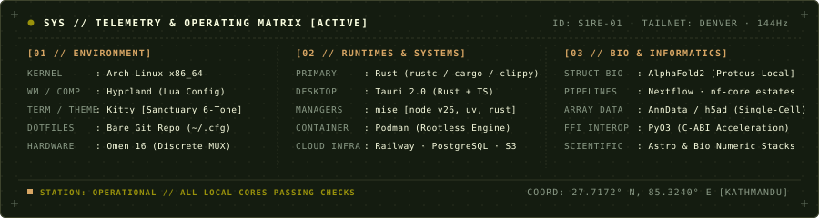

<div align="center">


<br/>

```
SYS // KATHMANDU (GMT+5:45)  ·  TAILNET: DENVER NODE  ·  STATUS: [ OPERATIONAL ]
CORE // SYSTEMS ARCHITECTURE  ·  BIOINFORMATICS  ·  OFFLINE-FIRST COMPUTING
```

<p align="center">
  <a href="https://s1re.sh"></a>
  <a href="mailto:serotoninotonin@gmail.com"></a>
  <a href="https://github.com/OtoYuki"></a>
  <a href="https://linkedin.com/in/sushanthona"></a>
</p>

</div>

---

### `//` TELEMETRY & SPECIFICATION

```yaml
identity:
  handle: s1re
  name: Sushant Hona
  role: Technical Director @ Press1-Inc
  credentials: BSc (Hons) Computing (AI) · First Class (79.17%)

operating_parameters:
  focus: [Offline-First Rust Systems, High-Throughput Bio-Pipelines, Local Compute]
  kernel: Arch Linux x86_64 // Hyprland Lua Compositor
  workstation: HP Omen 16 (Discrete MUX Locked // Dual High-Refresh Displays)
  dotfiles: Bare git repository (~/.cfg)
  runtimes: mise [rustc, uv, node 26] · podman
```

---

### `//` SELECTED ARCHITECTURES & RECORD

```
┌── [01] PRESS1-POS // RETAIL HARDWARE RUNTIME ────────────────────────────────┐
│  • Architecture: Offline-first Point of Sale built with Rust & Tauri         │
│  • Deployment: Sunmi D3 Pro (Android) fleet across live physical stores      │
│  • Backend: Railway cloud synchronization, companion web portal, and egress  │
│  • Focus: Hardware protocol interfacing, zero-latency caching, sync engine   │
└──────────────────────────────────────────────────────────────────────────────┘
```

```
┌── [02] PROTEUS // CONSUMER SILICON BIO-COMPUTE ──────────────────────────────┐
│  • Architecture: AlphaFold2 pipeline engineered for local execution          │
│  • Target: Production protein structure prediction on consumer GPU limits    │
│  • Trade-offs: Extreme memory-vs-compute profiling and VRAM paging bounds    │
│  • Focus: High-dimensional tensor ops, structural biology, local AI runtimes │
└──────────────────────────────────────────────────────────────────────────────┘
```

```
┌── [03] DATA PIPELINES // LARGE-SCALE SCIENTIFIC INFORMATICS ─────────────────┐
│  • Architecture: Nextflow & nf-core pipeline orchestration                   │
│  • Data Scales: Multi-gigabyte to terabyte array handling (h5ad, single-cell)│
│  • Performance: Custom PyO3 Rust FFI extensions and deterministic benchmarks │
│  • Focus: Single-cell transcriptomics, RNA-seq, reproducible workflow engines│
└──────────────────────────────────────────────────────────────────────────────┘
```

---

### `//` TOOLCHAIN & INSTRUMENTATION

| Subsystem | Stack & Technologies |
| :--- | :--- |
| **Systems & Low-Level** | `Rust` `Cargo` `Tauri` `PyO3 (FFI)` `C/C++` `Linux Kernel / Hardware Protocols` |
| **Informatics & AI** | `AlphaFold2` `Nextflow / nf-core` `Python / uv` `PyTorch` `NumPy / AnnData (h5ad)` |
| **Distributed & Cloud** | `Railway` `PostgreSQL` `Tailscale Mesh` `Docker / Podman` `REST & Event Egress` |
| **Interface & Product** | `TypeScript` `Next.js` `React` `Tailwind CSS` `Industrial UI / Micrographics` |
| **Workstation OS** | `Arch Linux` `Hyprland (Lua)` `Kitty` `Sanctuary Color Tokens` `Bare Git Repo` |

---

### `//` INSTRUMENTATION & TELEMETRY MATRIX

<div align="center">
  
</div>

<br/>

<div align="center">
  
</div>

---

### `//` ENGINEERING CONSTITUTION

> *"Under-proven. Not under-qualified. Proof is in the pull request."*
>
> 1. **Offline-First Resilience** — Networks are fallible; client systems must operate indefinitely without cloud connectivity.
> 2. **Observable Trade-Offs** — Measure memory bandwidth, cache misses, and query latencies before claiming optimization.
> 3. **High-Craft Minimalism** — Functional micrographics, intentional typography, and software engineered to do one thing with ruthless precision.

---

<div align="center">
  <pre>
  ~ $ ssh s1re@s1re.sh
  Access granted: Sushant Hona [Kathmandu, NP]
  ============================================================
  </pre>
  <sub>Designed with the Sanctuary Palette: Ink #141C10 · Cream #FBFFE1 · Tan #D8A664 · Olive #99920B · Sage #8A9A86</sub>
</div>
