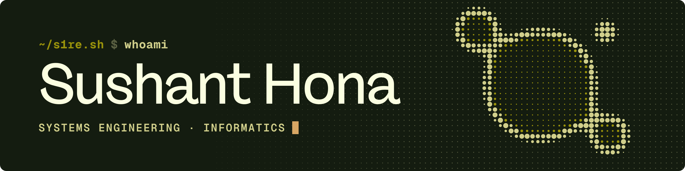
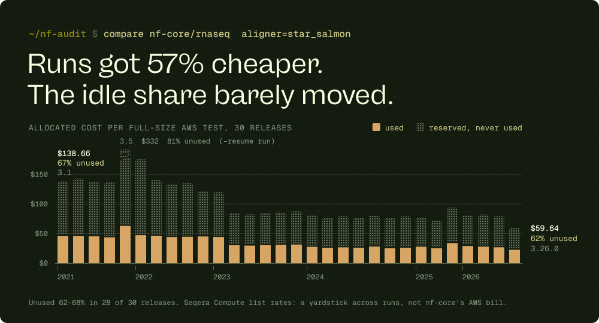

 

**Rust and systems engineer. I measure what Nextflow pipelines cost, process by process, then make them cost less.** 
Technical Director at <a href="https://press1.dev">press1-inc</a> · Kathmandu, UTC+5:45 · taking contract work

 

 

### `//` NOW

**Pipeline cost and performance, measured.** A batch scheduler reserves what a task *requests*, not what it uses, and the gap is already recorded in two files every Nextflow run writes. I built [**nf-audit**](https://github.com/OtoYuki/nf-audit) to read them, then pointed it at 61 of nf-core/rnaseq's public full-size AWS test runs, five years of releases.

- **62–68% of allocated cost was never used**, in 28 of 30 `star_salmon` releases, while the cost of a run fell from $138.66 (3.1) to $59.64 (3.26.0).
- **`QUALIMAP_RNASEQ` requests 6 CPUs and 36 GiB** in every release. No task of it ever averaged more than 1.08 cores.
- **`RSEM_CALCULATEEXPRESSION` hit its 16-hour limit** and failed the `star_rsem` test in four releases, on a 12-CPU / 72 GiB reservation whose completed tasks average a median of 1.04 cores. I reported it in [nf-core/rnaseq#1957](https://github.com/nf-core/rnaseq/issues/1957). An nf-core member confirmed the numbers and opened [#1959](https://github.com/nf-core/rnaseq/pull/1959) to right-size it.
- **The parsing is checked:** nf-audit's requested CPU-hours match the figure in Nextflow's own report header on all 61 runs, to within 0.1 CPU-hours.

Dollar figures use Seqera Compute list rates ($0.10/CPU-h, $0.025/GiB-h) as one yardstick across runs. They are not what AWS billed nf-core. Every number, with the command and report behind it, is in <a href="https://github.com/OtoYuki/nf-audit/tree/main/examples"><code>nf-audit/examples</code></a>.

**→ Send me a trace.** The `execution_trace_*.txt` and `execution_report_*.html` from one recent run are enough, and I don't need access to your code. I'll tell you within a day whether an audit is worth your money: [sushanthona04@gmail.com](mailto:sushanthona04@gmail.com)

 

### `//` PROOF

<table>
<tr>
<td width="50%" valign="top">

**[nf-audit](https://github.com/OtoYuki/nf-audit)** &nbsp;Rust · MIT

Where the CPU-hours and dollars of a Nextflow run go: per-process cost, unused allocation, retry waste, cost per sample, and a right-sized `nextflow.config`. Reads the trace and report every run already writes. Offline, on any executor.

`inspect` · `analyze` · `compare` · a public 61-run corpus in `examples/`

</td>
<td width="50%" valign="top">

**[proteus](https://github.com/OtoYuki/proteus)** &nbsp;Rust · MIT / Apache-2.0

The protein-engineering design loop as one binary: mutate, fold, batch-QC structures into Parquet, score variants with ESM-2, view them in the terminal or a browser, plus a GA4GH TES 1.1 server.

Every number that has an independent implementation is checked against it in CI on every push: mdtraj, FreeSASA, cctbx, PLIP.

</td>
</tr>
<tr>
<td width="50%" valign="top">

**Press1POS** &nbsp;Rust · Tauri v2 · React · private

Offline-first point of sale for Android: device app, sync layer, Railway backend and owner portal. I led it end to end as Technical Director at [press1-inc](https://press1.dev). It is in live testing in US stores.

Code review on every change, mine included. Architecture decisions recorded in the repo.

</td>
<td width="50%" valign="top">

**[nf-core/rnaseq#1957](https://github.com/nf-core/rnaseq/issues/1957)** &nbsp;upstream issue

`RSEM_CALCULATEEXPRESSION` timing out at 16 h in the full-size `star_rsem` tests of 3.22.1 and 3.23.0–3.25.0. The evidence came from the public megatest reports, alongside a local benchmark of the RSEM command at 1–12 threads.

Fix in review upstream: <a href="https://github.com/nf-core/rnaseq/pull/1959">#1959</a> (72 GB → 16 GB, 16 h → 24 h).

</td>
</tr>
</table>

 

### `//` ENGAGEMENTS

Fixed fee, agreed before work starts. Every proposal states what will be measured and how.

| Engagement | What you get | Time | Fee |
|---|---|---|---|
| **Diagnostic** | One production pipeline profiled on your data and infrastructure. You get cost and wall time by process, a ranked list of fixes with the projected saving on each, and a 45-minute readout. | 5 business days | $1,200, credited against the next tier |
| **Audit & fix** | The diagnostic, plus the top fixes implemented: resource right-sizing, spot and retry strategy, storage and staging layout, container and executor configuration. You get before-and-after benchmarks on your own data and a handover document. | 3–4 weeks | $4,500, 50% on signature |
| **Hot-path rewrite** | One bottleneck step reimplemented in Rust, benchmarked against the incumbent on your data, tested, containerised, and dropped into your workflow with nothing else changed. | 6 weeks | from $8,000, 50% on signature |

Also available by the hour for Rust backend and performance work on existing services. Contracts and invoices in USD, by wire or Payoneer.

 

### `//` METHOD

- **I measure before I touch anything**, and I don't promise percentages I haven't seen on your data.
- **Scope in writing** before work starts, and a short written update at every milestone.
- **Every change reviewed and benchmarked**, with a handover document at the end.
- **Offline-first by default.** I build systems that keep working when the network doesn't.

 

### `//` STACK

<table>
<tr><td><b>Rust</b></td><td>tokio · axum · serde · clap · sqlx · Arrow / Parquet · ratatui · Tauri v2</td></tr>
<tr><td><b>Pipelines</b></td><td>Nextflow · nf-core · execution traces and reports · AWS Batch and Seqera cost models</td></tr>
<tr><td><b>Science</b></td><td>RNA-seq (STAR, Salmon, RSEM) · protein structure QC · ESM-2 variant scoring</td></tr>
<tr><td><b>Backend&nbsp;&amp;&nbsp;infra</b></td><td>PostgreSQL · Railway · Podman / Docker · Tailscale · Linux</td></tr>
<tr><td><b>Also</b></td><td>Python (uv) · TypeScript · Next.js · React</td></tr>
</table>

 

### `//` RECORD

- **Technical Director, [press1-inc](https://press1.dev).** I run a five-person team working with US stakeholders. I wrote the company's founding charter, engineering constitution and review process, and led Press1POS. The team also shipped [deliverykingco.com](https://deliverykingco.com).
- **BSc (Hons) Computing (AI), First Class.** London Metropolitan University, taught at Islington College, 2025.
- **Kathmandu, UTC+5:45.** Daily overlap from 8am to 1pm US Eastern.

 

<picture>
  <source media="(prefers-color-scheme: dark)" srcset="assets/s1re-mark-contour-cream.svg" />
  
</picture>
 
Send a trace file. I reply within a day. · <a href="mailto:sushanthona04@gmail.com">sushanthona04@gmail.com</a>

